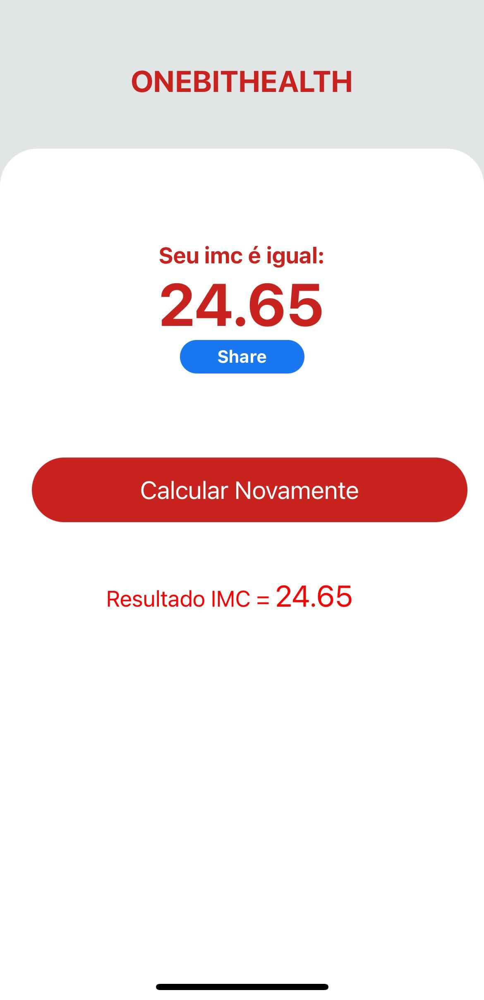

# 📱 Calculadora de IMC - React Native

Este é um aplicativo mobile desenvolvido em **React Native** com o objetivo de praticar os conhecimentos da tecnologia. O app permite calcular o **IMC (Índice de Massa Corporal)** do usuário com base no peso e altura informados, além de compartilhar o resultado utilizando os recursos nativos do dispositivo.

## 🧠 Objetivo do Projeto

Este projeto foi criado com fins educacionais, como parte do processo de aprendizado da linguagem **React Native**. O foco está em desenvolver a lógica de cálculo, manipulação de estado com hooks, uso de listas e interação com funcionalidades nativas do celular.

---

## ✨ Funcionalidades

- Entrada de altura e peso do usuário
- Cálculo automático do IMC
- Validação de campos obrigatórios
- Feedback visual e vibração em caso de erro
- Histórico de cálculos de IMC
- Compartilhamento do resultado via recursos nativos do dispositivo (a ser integrado na funcionalidade)

---

## 📷 Capturas de Tela

<!-- >  |  -->
<div align="center">
  
  
</div>

---

## 🚀 Tecnologias Utilizadas

- [React Native](https://reactnative.dev/)
- [Expo](https://expo.dev/)
- JavaScript (ES6+)
- Hooks (`useState`)

---

## ⚙️ Como Executar o Projeto

1. Clone o repositório:

```bash
git clone https://github.com/Reche-Lab/imc-calculator-react-native.git
```

2. Acesse a pasta do projeto:

```bash
cd imc-calculator-react-native
```

3. Instale as dependências:

```bash
npm install
```

4. Inicie o app:

```bash
npx react-native run-android
# ou
npx react-native run-ios
```

> Caso utilize o Expo:
```bash
npx expo start
```

---

## 📂 Estrutura do Projeto

```
.
├── App.js
├── src/components
│   └── Form.js
│   └── style.js
│   └── ResultImc
│      └── index.js
│      └── style.js
│   └── Title
│      └── ResultImc.js
│      └── style.js
├── assets
└── README.md
```

---

## 🧮 Cálculo do IMC

A fórmula utilizada para calcular o IMC é:

```
IMC = peso / (altura * altura)
```

> A altura deve ser fornecida em metros (ex: 1,75) e o peso em quilogramas (ex: 70).

---

## 📤 Compartilhamento

A funcionalidade de compartilhamento está integrada para uso dos recursos nativos do celular, podendo ser ativada com uma simples ação no botão (ex: `Share` API do React Native).

---

## 📌 Melhorias Futuras

- [ ] Melhorar a interface com animações e transições
- [ ] Implementar testes unitários com Jest
- [ ] Internacionalização (i18n)

---

## 👨‍💻 Autor

Desenvolvido por [Bruno Reche](https://github.com/Reche-Lab) 🚀  
Este projeto é uma iniciativa de estudo com React Native.

---

## 📝 Licença

Este projeto está licenciado sob a licença MIT. Veja o arquivo [LICENSE](LICENSE) para mais detalhes.
